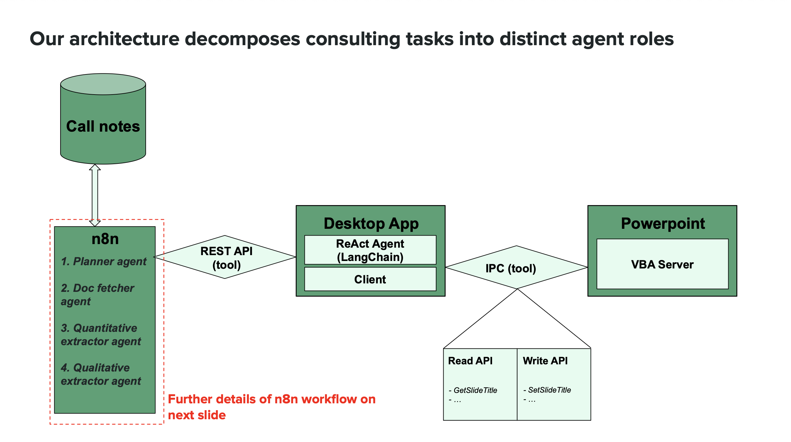
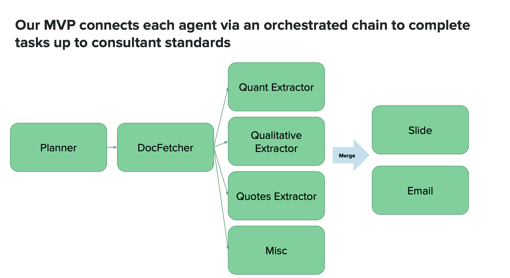
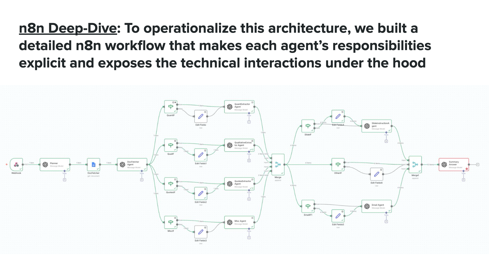

# agentic-workflows
Agentic AI and ML projects — exploring agent coordination, workflow automation, and real-world enterprise applications

# Agentic Workflows

Agentic AI and ML projects exploring agent coordination, workflow automation, and real-world enterprise applications. Built during my Wharton MBA (AI major, agentic AI independent study) and ongoing personal exploration.

---

## Project 1: Multi-Agent Research Workflow for Management Consulting

A working implementation of a multi-agent system that automates primary research synthesis from consulting call transcripts. The system decomposes tasks into specialist agents, each handling a distinct responsibility with explicit handoffs.

### System architecture

The architecture connects call transcripts through an n8n orchestration layer, coordinating specialist agents (Planner, DocFetcher, QuantExtractor, QualitativeExtractor, QuotesExtractor, Misc) that communicate via LangChain ReAct agents. A custom VBA bridge handles PowerPoint integration for slide updates.

### Agent orchestration

Each agent has a narrow, well-defined responsibility:

- **Planner Agent** decomposes the task and routes to specialists
- **DocFetcher Agent** retrieves source materials
- **QuantExtractor Agent** pulls quantitative data (e.g., NPS, sentiment scores)
- **QualitativeExtractor Agent** synthesizes themes and insights
- **QuotesExtractor Agent** surfaces representative quotes
- **Misc Agent** handles edge cases and unstructured tasks
- **Slide Agent** drafts slide updates from extracted content
- **Email Agent** formats end-of-day summaries for senior leads

After all agents complete, a merge step consolidates outputs before final delivery.

### n8n workflow implementation

The n8n workflow makes each agent's responsibilities explicit and exposes the technical interactions under the hood. This operational view shows how agents hand off work, where merge points sit, and how the system routes between specialist agents based on task decomposition.

### Architecture choices

- **Agent specialization with explicit handoffs** keeps each agent's context narrow and outputs auditable
- **Custom PowerPoint action library** (e.g., `add_bullet_point`, `update_chart`) wraps the native API into agent-safe primitives — without it, agents struggled with low-level fragility
- **Diff-based human-in-the-loop review** with accept/reject (inspired by Git and Cursor) addresses the trust gap that gates enterprise adoption

### Tech stack

n8n for orchestration, OpenAI and Anthropic APIs for agent reasoning, LangChain ReAct agents for routing, custom VBA bridge for PowerPoint integration.

---

## Why consulting

The project started with a different question: where in knowledge work does agentic AI actually unlock ROI, not just productivity? Early prototyping in search-fund sourcing showed lots of repetitive tasks but revealed lead volume wasn't the real bottleneck — so the ROI thesis didn't hold.

Pivoted to consulting, where efficiency gains translate directly into more case capacity and reduced analyst burden. Within consulting, primary research from call transcripts is the highest-signal, highest-volume input — which made it the right place to build an MVP.

## Four insights from the build

1. **Integration friction, not model capability, is the real bottleneck.** Agents performed well on extraction and synthesis, but the biggest blockers were enterprise integration details: PowerPoint APIs aren't agent-friendly, no version control or accept/reject flow, and n8n orchestration proved slow. The "last mile" determines adoption more than the AI itself.

2. **Platform giants will commoditize generic integrations; moat lies in deep workflow expertise.** Office products already have privileged access and native rendering. Copilot will commoditize actions like note-taking and slide drafting. Defensibility comes from verticalization — knowledge of how analysts actually work, not horizontal features.

3. **Market selection matters: costly integrations only pay off in large, repeatable verticals.** Consulting is a workflow fit but a difficult commercial market (limited buyers, slow procurement, high security requirements). High integration tax requires spreading that cost across many customers in scalable industries.

4. **Trust, not speed, is the gating factor for enterprise adoption.** Enterprises need explainability, traceability, and rollback paths. High-risk edits require human-in-the-loop review. Adoption happens when customers feel in control — trust infrastructure matters as much as model intelligence.

For the full strategic context — including the consulting workflow prioritization framework, MVP architecture details, and technical bottlenecks — see [Agentic_AI___ISP_Final_Output__1_.pdf](./Agentic_AI___ISP_Final_Output__1_.pdf) in this repo.

---
